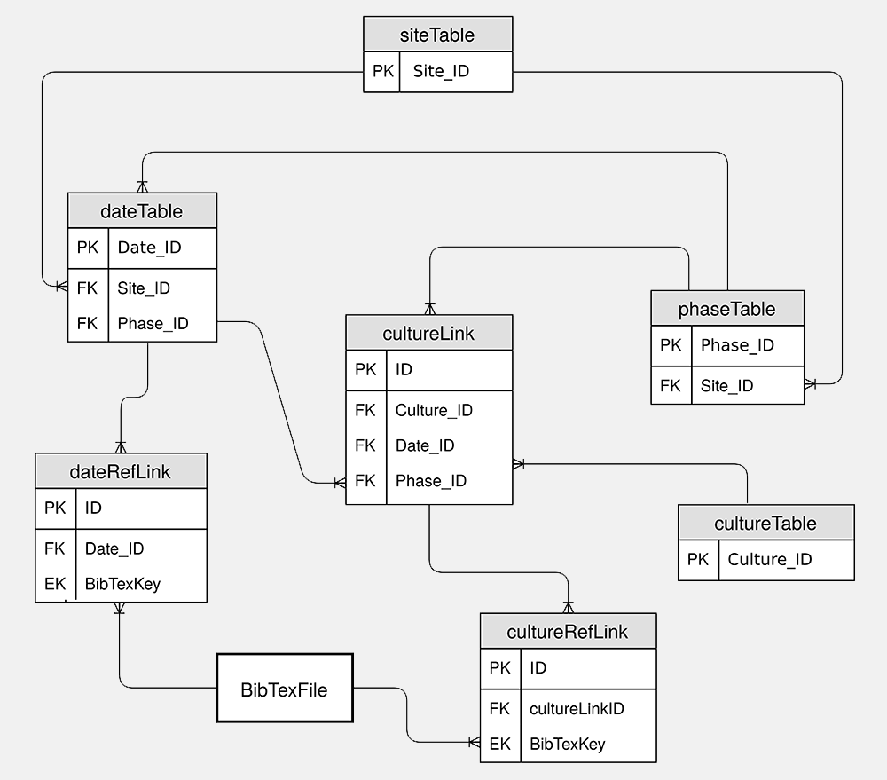

# MedAfriCarbon database

MedAfriCarbon radiocarbon database and web app are outcomes of the _MedAfrica Project —Archaeological deep history and dynamics of Mediterranean Africa, ca. 9600-700 BC_. The dataset presented here includes a collection of **1584** calibrated archaeological 14C dates from **1587** samples collected from **368** sites located in Mediterranean Africa (plus some additional dates whose published information is incomplete). The majority of the dates are linked to cultural and environmental variables, notably the presence/absence of different domestic/wild species and specific material culture.

## Citation

Please cite this database using the following reference:

> Giulio Lucarini, Toby Wilkinson, Enrico R. Crema, Augusto Palombini, Andrew Bevan, Cyprian Broodbank (2020) **The MedAfriCarbon radiocarbon database and web application. Archaeological dynamics in Mediterranean Africa, ca. 9600-700 BC**. Version 1.0. _Journal of Open Archaeology Data_, 8(1).  https://doi.org/10.5334/joad.60.

## Version history

The latest Zenodo version should always be accessible from: https://doi.org/10.5281/zenodo.3630619

- `1.0.3` _27 Feb 2020_– Official public JOAD release (includes JOAD DOI and volume numbers).
- `1.0` _30 Jan 2020_— First public release of the dataset on Zenodo, [doi:10.5281/zenodo.3630620](https://doi.org/10.5281/zenodo.3630620).
- `0.9` _15 Dec 2019_ — Peer review version.
- `0.x` — Pre-release versions.

## Database Contents

The main database tables and link tables are stored in a series of CSV files, plus a single BibTeX database file.

- `cultureLink.csv`
- `cultureTable.csv`
- `cultureRefLink.csv`
- `dateRefLink.csv`
- `dateTable.csv`
- `phaseTable.csv`
- `siteTable.csv`
- `bibliography.bib`

In addition the LICENSE for the database and its re-use is described in a single Markdown file, `LICENSE.md`.

## Metadata: schema description for tables

Key relationships between tables in the database can be visualised as follows:

### Table schema descriptions

Explanations for the meaning of fields used in the database are described within individual CSV files per table or link table, prefixed by `schema_`.

- `metadata/schema_cultureLink.csv`
- `metadata/schema_cultureTable.csv`
- `metadata/schema_cultureRefLink.csv`
- `metadata/schema_dateRefLink.csv`
- `metadata/schema_dateTable.csv`
- `metadata/schema_phaseTable.csv`
- `metadata/schema_siteTable.csv`

These files are structured with the following fields:

- **"Field"** - Field or column name for this table (no spaces used)
- **"Key"** - Defines whether this field is a key of any kind. Options are: "`PK`" (primary key) or "`FK`" (foreign key), "`EK`" (external key, e.g. for BibTeX) or "`OL`" (option list)
- **"VariableType"** - A machine-readable categorisation of the content type of the field (e.g. "String","Integer","Decimal")
- **"Description"** - Human-readable description of field meaning, use or derivation
- **"OptionsMetaSchema"** - For "OL" keys or lists. Name of the option schema/file to be used to define options/factors for the field (only used for fields with structured options or are lists)
- **"ForeignKeyLink"** - For "FK" keys. Name of key in foreign table

### Options descriptions

Some fields are effectively structured or predefined lists. In this case, the description of the meaning of the possible options are provided in a separate `options_` csv file.

- `metadata/options_contentType.csv`
- `metadata/options_country.csv`
- `metadata/options_culturalAssociation.csv`
- `metadata/options_locationQuality.csv`
- `metadata/options_phaseByExcavator.csv`

These files are structured with the following fields:

- **"Option"** - Potential value of field as it appears in the raw database (effectively an option "key")
- **"OptionDescription"** - Human-readable description of the meaning of this value

### Important Keys

- *"Date_ID"* - unique radiocarbon date identifiers are based on laboratory-defined unique date identifiers where available
- *"Site_ID"* - unique site identifiers are based on abbreviated identifier , international code of the country where the site is located followed by a sequential number (e.g. `DZ021`)
- *"Phase_ID"* - unique local cultural phase identifier from a certain site using a combination of the site code followed by a sequential number corresponding to the number of phases detected, and with 1 as the oldest one (e.g. `DZ021-1`)
- *"Culture_ID"* - unique culture key is defined a textual identifier of the culture (or cultural phase), usually identical to the lowest level of cultural phase definition (e.g. `1st Intermediate Period`)
- *"BibTexKey"* - unique BibTeX-style identifiers for bibliographic references reference the `bibliography.bib` file

### Shiny app settings

Settings for the linked Shiny app are contained within `shinyapp` and are documented elsewhere.
